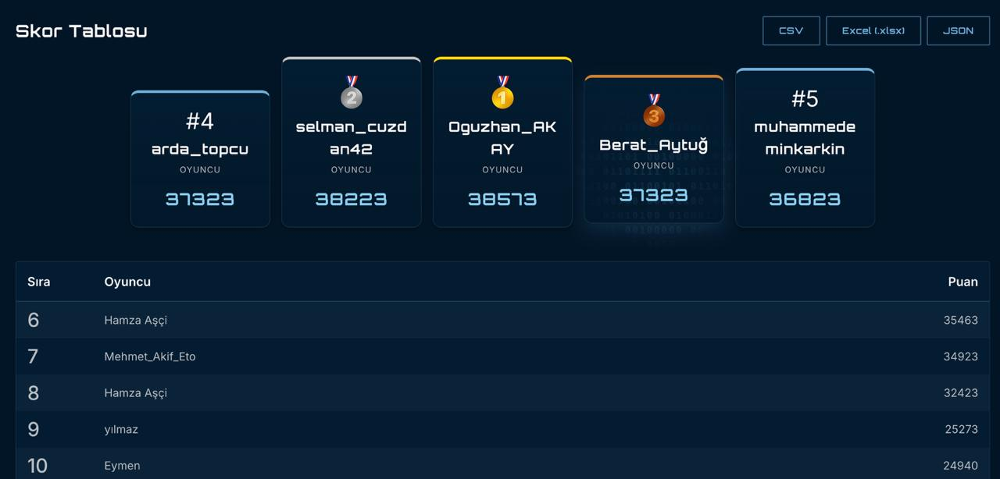

# ISUCTF 2026 — Writeup

ISUCTF 2026 yarışmasında çözülen sorular için yazılmış writeup koleksiyonu. Her soru kendi klasöründe, `README.md` içinde adım adım anlatılmıştır.

## 🏆 Sıralama



**🥈 2. sıra — `selman_cuzdan42` — 38223 puan**

| Sıra | Oyuncu | Puan |
|------|--------|------|
| 🥇 1 | Oguzhan_AKAY | 38573 |
| 🥈 2 | **selman_cuzdan42** | **38223** |
| 🥉 3 | Berat_Aytuğ | 37323 |
| 4 | arda_topcu | 37323 |
| 5 | muhammedeminkarkin | 36823 |

> **Toplam çözülen soru:** 88

---

## Kategori Lejantı

- 🔍 **Forensics** — log, disk, memory, browser, mobile artifact
- 🌐 **Network** — PCAP, DNS, HTTP, firewall analizi
- 🔐 **Crypto** — klasik şifre, RSA, XOR, hash
- 🧱 **Reverse** — binary, bytecode, custom VM, native lib
- 🎨 **Stego** — görsel LSB, ses spektrogram, polyglot
- 🕸️ **Web** — logic flaw, auth bypass, GraphQL, JS obfuscation
- ☁️ **Cloud** — Kubernetes RBAC, AWS IAM, OPA admission
- 🧠 **SIEM/TI** — alarm korelasyon, attack graph, threat hunting

---

## Soru Listesi

| # | Soru | Kategori | Çözüm |
|---|------|----------|-------|
| 01 | [Eski Afiş](ISUCTF2026/01-eski-afis/) | OSINT / Görsel | `ISUCTF{POSTER-OLD-63}` |
| 02 | [Sembollü Dosya](ISUCTF2026/02-sembollu-dosya/) | Forensics | `ISUCTF{LINK-TARGET-74}` |
| 03 | [Görünmeyen Mürekkep](ISUCTF2026/03-gorunmeyen-murekkep/) | Stego | `ISUCTF{INK-HIDDEN-28}` |
| 04 | [Silinmiş Gibi](ISUCTF2026/04-silinmis-gibi/) | Forensics / ZIP | `ISUCTF{ZIP-TRACE-512}` |
| 05 | [Sessiz Komut](ISUCTF2026/05-sessiz-komut/) | Forensics / Windows | `ISUCTF{6AMDEH-YN2RVS-CD9KYV}` |
| 06 | [Gizli Çevre](ISUCTF2026/06-gizli-cevre/) | Forensics / Sistem | `ISUCTF{ENV-TRACE-501}` |
| 07 | [Proxy Gölgesi](ISUCTF2026/07-proxy-golgesi/) | Network | `ISUCTF{PROXY-HIT-322}` |
| 08 | [Trafikteki Nesne](ISUCTF2026/08-trafikteki-nesne/) | Network / PCAP | `ISUCTF{86LNCZ-VGZ3VH-J4PEZA}` |
| 09 | [Ortak Modül](ISUCTF2026/09-ortak-modul/) | Crypto / RSA | `ISUCTF{ZGBUPS-4SW52C-VVHH8A}` |
| 10 | [Tekrar Eden Nonce](ISUCTF2026/10-tekrar-eden-nonce/) | Crypto | `ISUCTF{AKV37C-WQVUDM-T2LSBS}` |
| 11 | [Düzgün Bloklar](ISUCTF2026/11-duzgun-bloklar/) | Encoding | `ISUCTF{BLOCK-DECODE-33}` |
| 12 | [Katmanlı Zarf](ISUCTF2026/12-katmanli-zarf/) | Crypto / Encoding | `ISUCTF{ENVELOPE-END-73}` |
| 13 | [Tekrar Eden Anahtar](ISUCTF2026/13-tekrar-eden-anahtar/) | Crypto / XOR | `ISUCTF{XOR-REUSE-404}` |
| 14 | [Sorgu Satırı](ISUCTF2026/14-sorgu-satiri/) | Network / DNS | `ISUCTF{DNS-ROW-481}` |
| 15 | [Sessiz Kanal](ISUCTF2026/15-sessiz-kanal/) | Network / DNS Tunnel | `ISUCTF{DNS_TUNNEL_TRACE}` |
| 16 | [Fazla İndirim](ISUCTF2026/16-fazla-indirim/) | Web / Logic | `ISUCTF{R3WAJQ-C8GRRG-YHEB9R}` |
| 17 | [Parça Parça](ISUCTF2026/17-parca-parca/) | Forensics / Carving | `ISUCTF{CHUNK-END-602}` |
| 18 | [Rayların Üstünde](ISUCTF2026/18-raylarin-ustunde/) | Crypto / Rail Fence | `ISUCTF{RAIL-FENCE-61}` |
| 19 | [Yanlış Rol](ISUCTF2026/19-yanlis-rol/) | Cloud / Kubernetes RBAC | `ISUCTF{J4756Y-WPBS2E-UP7Q2B}` |
| 20 | [Kırık Başlık](ISUCTF2026/20-kirik-baslik/) | Forensics / Carving | `ISUCTF{B52T2Q-MC7GBK-T6EK7Y}` |
| 21 | [Tarayıcı Hatırlıyor](ISUCTF2026/21-tarayici-hatirliyor/) | Forensics / Browser | `ISUCTF{VCHNU7-V8J5FK-3Q6RVX}` |
| 22 | [Kayıp Karekod](ISUCTF2026/22-kayip-karekod/) | Stego / Polyglot | `flag_vault` |
| 23 | [Cron'un Notu](ISUCTF2026/23-cronun-notu/) | Forensics / Linux | `ISUCTF{AN63X4-FLDJ4J-EWULWF}` |
| 24 | [En Kısa Yol](ISUCTF2026/24-en-kisa-yol/) | TI / Graf | `ISUCTF{VX3E2Z-KWL4EP-QGD995}` |
| 25 | [Sessiz Frekans](ISUCTF2026/25-sessiz-frekans/) | Stego / Ses | `flag_vault` |
| 26 | [Kevin's Cipher](ISUCTF2026/26-kevins-cipher/) | Reverse / XOR | `flag{kevin_mitnick}` |
| 27 | [Boğaz Sinyali](ISUCTF2026/27-bogaz-sinyali/) | Stego / Metadata | `ISUCTF{NIGHT_SIGNAL_BOSPHORUS}` |
| 28 | [Bozuk Spektrum](ISUCTF2026/28-bozuk-spektrum/) | Stego / Ses | `flag_vault` |
| 29 | [Seri Numarası](ISUCTF2026/29-seri-numarasi/) | Reverse / Vault | `ISUCTF{4D3CDY-FXYUHB-TLK8G8}` |
| 30 | [Affine Cipher](ISUCTF2026/30-affine-cipher/) | Crypto / Klasik | `ISUCTF{AFFINE-MOD-91}` |
| 31 | [Docker Katmanı](ISUCTF2026/31-docker-katmani/) | Forensics / Container | `ISUCTF{LAYER-TRACE-884}` |
| 32 | [Parçalı Paket](ISUCTF2026/32-parcali-paket/) | Network / PCAP | `ISUCTF{NM75ER-3U7XRC-V4Y78G}` |
| 33 | [Alpha Kanalı](ISUCTF2026/33-alpha-kanali/) | Stego / File | `flag_vault` |
| 34 | [Parça Kontrol](ISUCTF2026/34-parca-kontrol/) | Reverse / Python | `ISUCTF26{SPLIT-CHECK-41}` |
| 35 | [Son Pikseller](ISUCTF2026/35-son-pikseller/) | Stego / LSB | `flag_vault` |
| 36 | [Fısıltı Anahtarı](ISUCTF2026/36-fisilti-anahtari/) | Crypto / XOR | `flag_vault` |
| 37 | [E-posta Zinciri](ISUCTF2026/37-eposta-zinciri/) | Forensics / Email | `ISUCTF{WU8YC2-GJPMJA-UBRUBT}` |
| 38 | [Sessiz Ek](ISUCTF2026/38-sessiz-ek/) | Forensics / Polyglot | arşivden |
| 39 | [Paket Günlüğü](ISUCTF2026/39-paket-gunlugu/) | Network / PCAP | JSON ref |
| 40 | [Kayıp Profil Görseli](ISUCTF2026/40-kayip-profil-gorseli/) | Forensics / EXIF | `ISUCTF{PROFILE-META-909}` |
| 41 | [Zamanlı DNS](ISUCTF2026/41-zamanli-dns/) | Network / Covert | `ISUCTF{9Z5DMG-QUR2DU-JKTA2M}` |
| 42 | [Tekrar Eden İmza](ISUCTF2026/42-tekrar-eden-imza/) | Crypto / DSA | `ISUCTF{Q22JMF-RTLRPV-HU7RE3}` |
| 43 | [Opcode Kapısı](ISUCTF2026/43-opcode-kapisi/) | Reverse / VM | `ISUCTF{XJ74CF-HKEU7N-GP5B83}` |
| 44 | [Katmanlı Akış](ISUCTF2026/44-katmanli-akis/) | Network / PCAP | `ISUCTF{AL4D4Q-2NZ5SZ-MCUWXZ}` |
| 45 | [Alarm Zinciri](ISUCTF2026/45-alarm-zinciri/) | SIEM | `ISUCTF{ALERT-CHAIN-205}` |
| 46 | [Kart Tablosu](ISUCTF2026/46-kart-tablosu/) | Crypto / Polybius | `ISUCTF{GRID-CODE-57}` |
| 47 | [Hacker Shadow](ISUCTF2026/47-hacker-shadow/) | Misc | dosyadan |
| 48 | [Ses Dalgasına Kod](ISUCTF2026/48-ses-dalgasina-kod/) | Stego / Ses | `ISUCTF{s3s_sp3ktr0gram}` |
| 49 | [Eski Oyun Kaydı](ISUCTF2026/49-eski-oyun-kaydi/) | Forensics / Binary | `flag_vault` |
| 50 | [Günlük Kalıntısı](ISUCTF2026/50-gunluk-kalintisi/) | Forensics / Disk | `ISUCTF{N2B5EW-2BKY3W-GNKJTK}` |
| 52 | [Git Gölgesi](ISUCTF2026/52-git-golgesi/) | Forensics / Git | `ISUCTF{audit-a3f9c12e}` |
| 53 | [Kim Okuyabilir](ISUCTF2026/53-kim-okuyabilir/) | Linux / Perms | `ISUCTF{PERM-READ-812}` |
| 54 | [Yanlış Etiket](ISUCTF2026/54-yanlis-etiket/) | Forensics / Polyglot | `flag_vault` |
| 55 | [Bytecode Grafı](ISUCTF2026/55-bytecode-grafi/) | Reverse / Python | `ISUCTF{AQZA7M-LCN39A-JE2FMZ}` |
| 56 | [WMI Zinciri](ISUCTF2026/56-wmi-zinciri/) | Forensics / Windows | `ISUCTF{CTD5C7-M2BWVU-FG5BDV}` |
| 57 | [Yerel Kütüphane](ISUCTF2026/57-yerel-kutuphane/) | Mobile / Android | `flag_vault` |
| 58 | [Arşiv Paketi](ISUCTF2026/58-arsiv-paketi/) | OSINT / Versiyon | `ISUCTF{ARCH-2026-C4}` |
| 59 | [Uzun Alan Adları](ISUCTF2026/59-uzun-alan-adlari/) | Network / DNS Exfil | `ISUCTF{LONG-DNS-930}` |
| 60 | [Minify Edilmiş Mantık](ISUCTF2026/60-minify-edilmis-mantik/) | Web / JS | `ISUCTF{JS-MIN-504}` |
| 61 | [Şüpheli Web Trafiği](ISUCTF2026/61-supheli-web-trafigi/) | Network / HTTP | `ISUCTF{NETWORK_TRACE}` |
| 62 | [Yanlış Protokol](ISUCTF2026/62-yanlis-protokol/) | Network / FTP | `ISUCTF{CLEARTEXT_LOGIN_FOUND}` |
| 63 | [Bytecode Notu](ISUCTF2026/63-bytecode-notu/) | Reverse / PYC | `ISUCTF{PYC-RECOVER-95}` |
| 64 | [Bellek Notu](ISUCTF2026/64-bellek-notu/) | Forensics / Memory | `ISUCTF{MEM-LEFT-808}` |
| 65 | [Yetki Zinciri](ISUCTF2026/65-yetki-zinciri/) | Cloud / AWS IAM | `ISUCTF{YT43ZE-GQYWRW-QWLDXG}` |
| 66 | [Günlükteki Sızıntı](ISUCTF2026/66-gunlukteki-sizinti/) | Forensics / Korelasyon | `ISUCTF{MFWV3Y-PML26U-HKE9N6}` |
| 67 | [TLV Firmware](ISUCTF2026/67-tlv-firmware/) | Embedded / FW | `ISUCTF{BVVYV8-E48HGC-LKH6BD}` |
| 69 | [Gece Vardiyası](ISUCTF2026/69-gece-vardiyasi/) | Forensics / Linux | `ISUCTF{DZRSMX-TVSSJU-5V2P5A}` |
| 70 | [Gizli Yükleyici](ISUCTF2026/70-gizli-yukleyici/) | Forensics / Rootkit | `ISUCTF{BBPC3X-5EMEES-396BJS}` |
| 71 | [Olasılık Alarmı](ISUCTF2026/71-olasilik-alarmi/) | SIEM / Bayes | `ISUCTF{P8P3MH-5S45DR-5ZF83B}` |
| 72 | [Etiket Boşluğu](ISUCTF2026/72-etiket-boslugu/) | Cloud / K8s OPA | `ISUCTF{KBGLCB-N82RHC-4J67NY}` |
| 73 | [Toplu Sorgu](ISUCTF2026/73-toplu-sorgu/) | Web / GraphQL | `ISUCTF{MR9B42-KSG3XW-Q7KCYB}` |
| 74 | [Zamansal Graf](ISUCTF2026/74-zamansal-graf/) | TI / Graf | `ISUCTF{C94Y3E-V45D5J-TGG3TD}` |
| 75 | [Kanonik İmza](ISUCTF2026/75-kanonik-imza/) | Web / Auth Bypass | `ISUCTF{LHU5MM-53YEVT-6SY6RH}` |
| 76 | [Bellekteki Anahtar](ISUCTF2026/76-bellekteki-anahtar/) | Forensics / Memory | `ISUCTF{TGSZ99-SQCAN7-NK7B8N}` |
| 77 | [Spectrum Whisper](ISUCTF2026/77-spectrum-whisper/) | Stego / Morse | `ISUCTF{MORSE_IN_SPECTRUM}` |
| 78 | [Gömülü Arşiv](ISUCTF2026/78-gomulu-arsiv/) | Forensics / Polyglot | arşivden |
| 79 | [Üç Günlük](ISUCTF2026/79-uc-gunluk/) | Forensics / Log | `ISUCTF{AUDIT-END-606}` |
| 80 | [DNS'in Söyledikleri](ISUCTF2026/80-dnsin-soyledikleri/) | Network / DNS Tunnel | `ISUCTF{E9PZSX-6WWZE9-8WS2MS}` |
| 81 | [Zeek Parçaları](ISUCTF2026/81-zeek-parcalari/) | Network / Zeek | `ISUCTF{ZEEK-LINK-714}` |
| 82 | [Kullanıcı Zincirleri](ISUCTF2026/82-kullanici-zincirleri/) | Web / Caesar | `ISUCTF{USER-CHAIN-84}` |
| 83 | [DHCP Eşleşmesi](ISUCTF2026/83-dhcp-eslesmesi/) | Network / DHCP | `ISUCTF{10.30.14.82}` |
| 85 | [Ortak Çarpan](ISUCTF2026/85-ortak-carpan/) | Crypto / RSA | `ISUCTF{FZW8J3-U9CZNV-6E24ES}` |
| 86 | [Arşiv Unutmaz](ISUCTF2026/86-arsiv-unutmaz/) | OSINT | `ISUCTF{UESY85-6FT5DY-M5Y6WG}` |
| 87 | [Kısmi Anahtar](ISUCTF2026/87-kismi-anahtar/) | Crypto / Vigenère | `ISUCTF{PARTIAL-KEY-508}` |
| 88 | [Gizlenmiş Sabit](ISUCTF2026/88-gizlenmis-sabit/) | Reverse / Strings | `ISUCTF{CONST-PART-66}` |
| 89 | [Kanal Karmaşası](ISUCTF2026/89-kanal-karmasasi/) | Stego / LSB | `ISUCTF{JPUFKB-E9XZ4P-WAZUHX}` |
| 90 | [Ters Kanal](ISUCTF2026/90-ters-kanal/) | Stego / DTMF | `ISUCTF{A3CQYE-NBQZ94-N6H2R8}` |
| 91 | [Crypto](ISUCTF2026/91-crypto/) | Crypto / Encoding | `ISUCTF{TOO-MUCH-ENCODING-IS-FUN}` |

---

## Tekrarlayan Yapı: `flag_vault.bin`

Yarışmadaki birçok soruda son aşama bir `flag_vault.bin` dosyasının çözülmesiydi. Şema şuydu:

```
kdf:    sha256(salt + solution_key)
cipher: xor-sha256-stream
```

Genel çözüm scripti:

```python
import json, base64, hashlib

vault = json.load(open("flag_vault.bin"))

salt = base64.b64decode(vault["salt_b64"])
ct   = base64.b64decode(vault["ciphertext_b64"])

key    = hashlib.sha256(salt + solution_key.encode()).digest()
stream = b""
counter = 0
while len(stream) < len(ct):
    stream += hashlib.sha256(key + counter.to_bytes(4, "little")).digest()
    counter += 1

flag = bytes(c ^ stream[i] for i, c in enumerate(ct))
print(flag.decode())
```

`solution_key`, her sorunun mantığını çözdükten sonra elde edilen marker değeri.

---

## Yazar

**Selman Cüzdan** — [@selmancuzdan42](https://github.com/selmancuzdan42)
